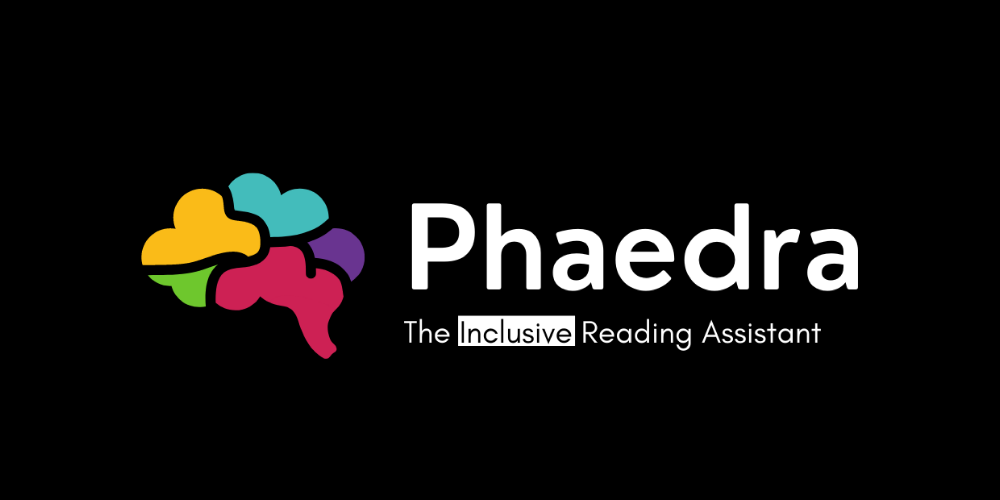
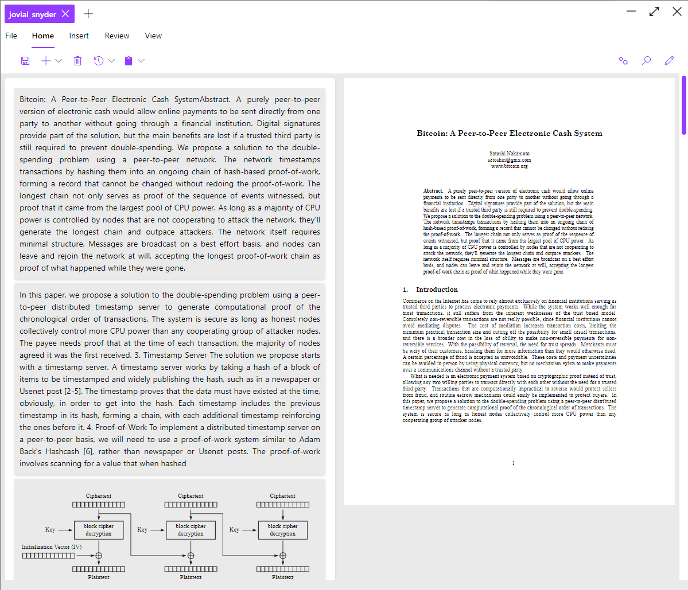

<p align="center">
  
</p>

A software that summarizes texts, selects key concepts and allows you to ask questions, using AI. Aimed towards people with intellectual disabilities and neurodivergent individuals, and to revolutionize the way we consume knowledge. Made for [HackMIT 2021](https://hackmit.org/).

<!-- <p align="center">
  
</p> -->

# Getting started

Phaedra is currently in a prototype state and is being actively developed. As of right now, the backend can be hosted either locally or using Google Colaboratory as a service provider. The latter option is recommended because of processing requirements.

## Running (developing and testing)

Run the backend locally (or serve it from [Google Colaboratory](https://colab.research.google.com/github/000alen/Phaedra/blob/master/backend/Phaedra_LocalMode.ipynb)):

```console
foo@bar:~$ cd backend
foo@bar:~$ python -m Phaedra.API
```

Then, run the frontend (client):

```console
foo@bar:~$ cd frontend
foo@bar:~$ yarn start
```

# Development

Read the TODO list [here](./TODO.md).

Read more about Phaedra's backend [here](./backend/README.md).

Read more about Phaedra's frontend [here](./frontend/README.md).

# Authors

- Noah Buccolini ([missresetti](https://github.com/missresetti))
- Carlos Pinto ([CxrlosKenobi](https://github.com/CxrlosKenobi))
- Alen Rubilar ([000alen](https://github.com/000alen))
- Sebastian Torrealba ([storrealbac](https://github.com/storrealbac))
