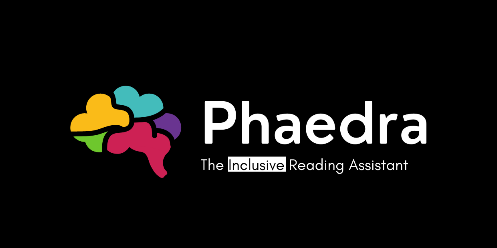
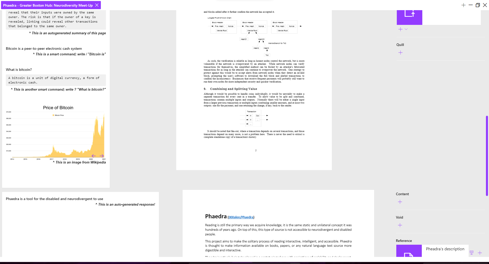

<p align="center">
  
</p>

A software that summarizes texts, selects key concepts and allows you to ask questions, using AI. Aimed towards people with intellectual disabilities and neurodivergent individuals, and to revolutionize the way we consume knowledge. Made for [HackMIT 2021](https://hackmit.org/).

# Getting started

Phaedra is currently in a prototype state and is being actively developed. As of right now, Phaedra relies on the OpenAI API for GPT-3 and therefore requires a API key for that service.

## Running (developing and testing)

<p align="center">
  
</p>

```console
foo@bar:~$ yarn install
foo@bar:~$ yarn start
```

# Development

Read the TODO list [here](./TODO.md).

# Authors

- Noah Buccolini ([missresetti](https://github.com/missresetti))
- Carlos Pinto ([CxrlosKenobi](https://github.com/CxrlosKenobi))
- Alen Rubilar ([000alen](https://github.com/000alen))
- Sebastian Torrealba ([storrealbac](https://github.com/storrealbac))
